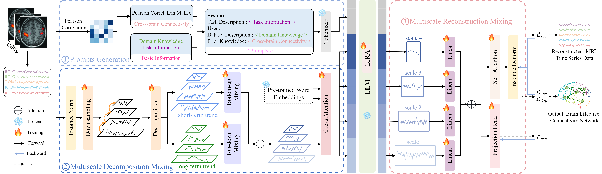
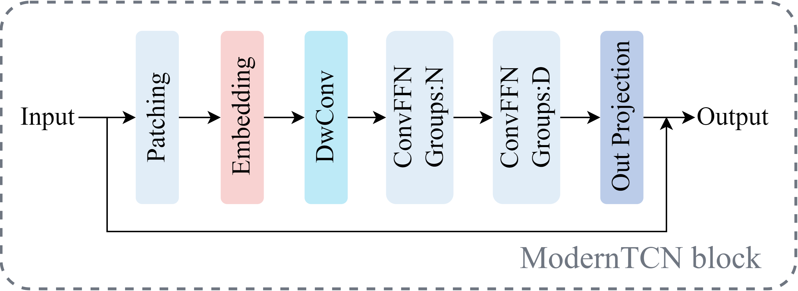

<div align="center">
  <h2><b> BrainEC-LLM: Brain Effective Connectivity Estimation by Multiscale Mixing Large Language Models (NeurIPS 2025) </b></h2>
</div>

---

> 🙋 Please let us know if you find out a mistake or have any suggestions!

## Introduction

We first design prompts generation module to generate prompts related to fMRI time series data to guide the LLM, which can enhance the ability of LLM to reason with fMRI time series data.  Next, we utilize multiscale decomposition mixing module to decompose fMRI time series data into  short-term and long-term multiscale trends for mixing in a bottom-up (fine to coarse) and top-down (coarse to fine) manner, respectively. 
Subsequently, cross attention is applied with pre-trained word embeddings to ensure consistency between the input and pre-trained natural language.
Then with prompts as prefix, it is concatenated with the multiscale fMRI embeddings and input into the LLM, and fine-tuning is performed with LoRA. 
Finally, the multiscale features output by the LLM are serve as the input for multiscale reconstruction mixing module to integrate the information across multiple scales.

<p align="center">

</p>

The detailed framework of ModernTCN block is illustrated in the fllowing figure:

<p align="center">

</p>

## Requirements

Use python 3.11 from MiniConda

- torch==2.2.2
- numpy==1.26.4
- scikit_learn==1.5.1
- scipy==1.13.1
- tqdm==4.65.0
- peft==0.11.1
- transformers==4.41.2
- bitsandbytes==0.43.1
- cdt==0.6.0
- matplotlib

To install all dependencies:

```
pip install -r requirements.txt
```

## Datasets

- **Simulated fMRI datasets:** 
  - You can access the well simulated fMRI datasets from [[Smith]](https://www.fmrib.ox.ac.uk/datasets/netsim/index.html) and [[Sanchez]](https://github.com/cabal-cmu/feedbackdiscovery), then place the downloaded contents under `../fMRI/`. 
  - The simulated dataset we generated using [[CDRL]](https://github.com/huawei-noah/trustworthyAI/tree/master/datasets) is located in path `../fMRI/GeneratedDatasets/CDRL/lingam_quad/`. The ground truth dataset in the folder seed42_node5_n_samples10000 contains 5 nodes, while the one in seed42_node7_n_samples10000 contains 7 nodes. Each folder includes 50 samples and a ground truth. 
- **Real resting-state fMRI dataset:** You can access the real resting-state fMRI dataset we used by navigating to the [[Real]](https://github.com/shahpreya/MTlnet) and placing it in the folder ... /fMRI/.

## Quick Demos

1. Download datasets and place them under `./fMRI`, see Datasets section.
2. Tune the model. We provide five experiment scripts for demonstration purpose under the folder `./scripts`. For example, you can evaluate on Smith datasets by:

```bash
bash ./scripts/BrainECLLM_smith.sh 
```

## Detailed usage

Please refer to ```run_main.py``` for the detailed description of each hyperparameter.
